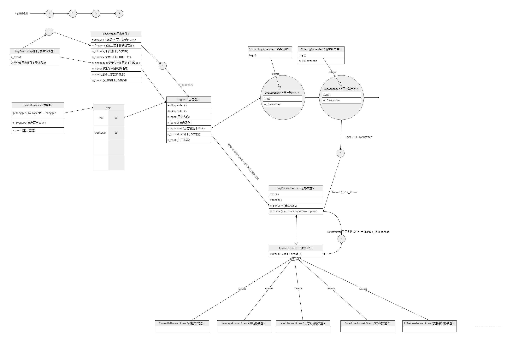
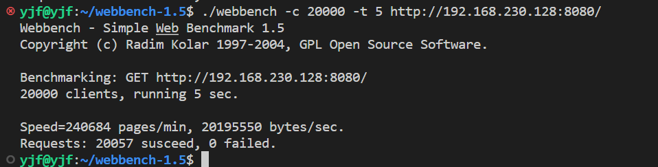
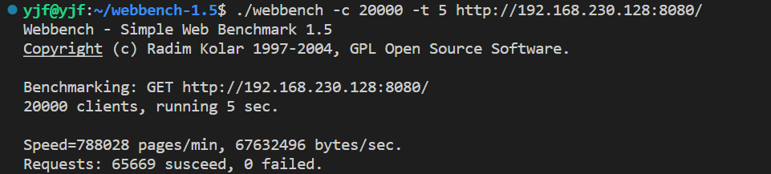

# webServer
--线程池+epoll
--模拟同步I/O的proactor模式

    --目录结构
    ├── build
    ├── CMakeLists.txt
    ├── Config.conf
    ├── README.md
    ├── root
    │   ├── images
    │   │   └── imag.jpg
    │   ├── index.html
    │   ├── rabbit.mp4
    │   └── welcome.html
    └── src
        ├── Client
        │   ├── client.cpp
        │   ├── client.h
        │   └── CMakeLists.txt
        ├── CMakeLists.txt
        ├── Config
        │   ├── CMakeLists.txt
        │   ├── Config.cpp
        │   └── Config.h
        ├── HTTP
        │   ├── CMakeLists.txt
        │   ├── Http.cpp
        │   ├── Http.h
        │   └── parse_status.h
        ├── Locker
        │   ├── CMakeLists.txt
        │   ├── locker.cpp
        │   └── locker.h
        ├── main.cpp
        ├── test
        ├── test.cpp
        ├── threadPool
        │   └── thread_pool.h
        ├── Timer
        │   ├── CMakeLists.txt
        │   ├── timer_list.cpp
        │   └── timer_list.h
        ├── Util
        │   ├── CMakeLists.txt
        │   ├── utils.cpp
        │   └── utils.h
        └── webServer
            ├── CMakeLists.txt
            ├── webServer.cpp
            └── webServer.h

项目简介（参考了开源项目TinyWebServer）

服务器是一个http服务器，主线程可以使用epoll的ET和LT模式通过监听服务器指定的socket是否有事件发生，有事件发生epoll_wait 通知主线程，如果事件是客户端的连接，就将用户的信息保存起来；如果事件是可读事件或者可写事件，使用的是同步 I/O 方式模拟Proactor 模式，主线程负责读和写相应socket的数据，将浏览器发送过来的数据读取到m_read_buf读缓冲区中，读取完成后，主线程通过 add() 方法将请求添加到队列中，主线程和所有子线程通过共享一个请求队列 m_work_queue来同步，并用互斥锁保证线程安全。子线程都睡眠在请求队列上，通过信号量控制。定时器使用时间轮算法，处理非活跃连接，日志系统

任务被添加到队列，则信号量加1

    任务队列：@1->@2->@3

信号量减1，子程从任务队列取出任务进行处理。子线程主要负责解析http请求报文，并准备请求的数据，http响应行，响应头放置在m_wirte_buf缓冲区，响应体使用mmap映射，数据准备好后，epoll触发可写事件，主线程使用writev将数据发送给请求端。

构建方式

    进入build在终端make,运行main程序
    数据库、ET、LT等配置在配置文件Config.conf文件写入

  <h2>类图</h2>
  

  <h2>测试结果 - proactor LT + LT</h2>
  

  <h2>测试结果 - proactor ET + ET</h2>
  

 

